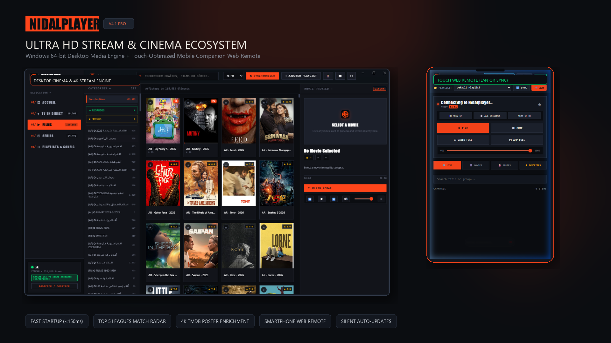
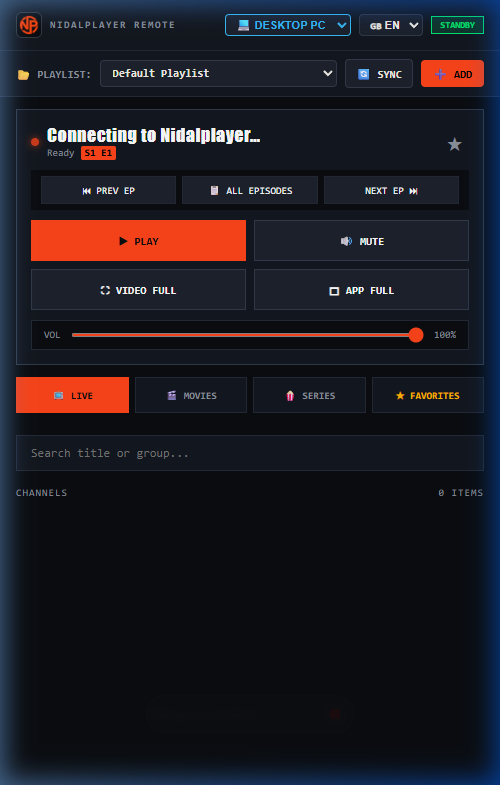

# Nidalplayer — Ultra HD M3U Stream & Cinema Player (Windows)

**Nidalplayer** is a high-performance, modernist streaming media center engineered specifically for Windows. Designed with an industrial Swiss aesthetic, it combines lightning-fast stream startup, real-time sports intelligence, 4K metadata discovery, live preview playback, and zero-configuration mobile companion remote control.

> [!NOTE]
> ### ⚡ Vibe-Coded Architecture Notice
> Most of this codebase was **vibe-coded** using AI pair programming. While extensively tested, feature-packed, and daily-driven with an automated test suite, **you may encounter occasional bugs, quirks, or edge-case issues**.
> 
> - 🐛 **Found a bug?** Please submit an issue on our [GitHub Issues tracker](https://github.com/nidal0xp/Nidalplayer/issues) with logs and reproduction steps.
> - 🛠️ **Want to help improve it?** Pull requests, cleanups, and community bug fixes are warmly welcomed! Check out [CONTRIBUTING.md](CONTRIBUTING.md).

---

## 📸 Presentation Showcase

  <em>Windows Desktop Media Center (left) & Smartphone Companion Web Remote (right)</em>

---

## 📱 Mobile Companion Web Remote

Scan the in-app QR code with any smartphone on your local Wi-Fi to launch the instant touch remote control — no phone app download required:

  

---

## 🚀 Key Features

* **⚡ Ultra-Low Latency Streaming Engine**:
  * Zero-delay stream initiation (<150ms startup).
  * High-compatibility synthetic byte-range M3U8 chunking for instant seeking (+10s / -10s) across all movies, episodes, and VOD streams.
  * Multi-track audio and subtitle selection with universal codec support (AAC, MP3, AC3, EAC3).

* **🎬 Integrated Cinema Preview & VOD Grid**:
  * Side-by-side instant playback preview panel with audio controls, synopsis display, and one-click cinema fullscreen mode.
  * High-density virtualized grid supporting hundreds of thousands of entries with 60 FPS fluid scrolling.
  * Real-time search reticle across live feeds, movies, and TV series.

* **⚽ Top 5 Football Leagues Match Center**:
  * Real-time match fixtures, live scores, and schedules for Premier League, La Liga, Serie A, Bundesliga, Ligue 1, and UEFA Champions League.
  * Automated broadcaster channel matching: effortlessly detects which live streams in your playlist are broadcasting the active match.
  * Tactical Starting XI lineups, substitutions, and team formations.

* **🌟 4K TMDB Metadata Enrichment**:
  * Clean title sanitization strips codec and release tags to fetch original 4K backdrops, posters, ratings, plot synopses, and cast headshots.
  * **User-Configurable**: Easily connect your own free [The Movie Database (TMDB)](https://www.themoviedb.org/settings/api) API key directly in **Settings > Playback & Performance Config**.

* **📱 Smartphone Companion Remote Control**:
  * Scan an in-app QR code with any smartphone camera to launch a responsive, touch-optimized web remote control over LAN. No phone app installation required.

* **🔄 Silent Background Auto-Updates**:
  * Built-in background auto-updater automatically checks for new releases on GitHub, downloads patches in the background, and prompts with a 1-click restart notification.

---

## 📥 Downloads (Windows x64)

| Release Package | File | Size | Description |
| :--- | :--- | :--- | :--- |
| **Windows Installer** | [`Nidalplayer-Setup-4.1.0.exe`](https://github.com/nidal0xp/Nidalplayer/releases/download/v4.1.0/Nidalplayer-Setup-4.1.0.exe) | ~84 MB | Standard Windows Setup with desktop & start menu shortcuts |
| **Portable Edition** | [`Nidalplayer-Portable.exe`](https://github.com/nidal0xp/Nidalplayer/releases/download/v4.1.0/Nidalplayer-Portable.exe) | ~75 MB | Standalone portable executable (no installation required) |
| **Update Manifest** | [`latest.yml`](https://github.com/nidal0xp/Nidalplayer/releases/download/v4.1.0/latest.yml) | 350 B | Cryptographic SHA-512 update verification manifest |

---

## ⚖️ Legal & Disclaimer

Nidalplayer is strictly a standalone software media player and client aggregator. **It does not host, provide, broadcast, or distribute any media content or playlists.** Users are exclusively responsible for supplying their own legitimate streams. For full details, please review our [DISCLAIMER](DISCLAIMER.md).

---

## 🤝 Contributing

Contributions, bug reports, and enhancements are welcome! Please review [CONTRIBUTING.md](CONTRIBUTING.md) for local development and pull request guidelines.

---

## 📜 License & Terms of Use

This project is licensed under the **Creative Commons Attribution-NonCommercial-ShareAlike 4.0 International (CC BY-NC-SA 4.0)** license with an anti-commercial clause.

### Summary of Terms:
* ✅ **Free for Personal Use**: You are welcome to download, use, study, modify, and share this software for non-commercial personal entertainment.
* ❌ **Commercial Sale is Strictly Prohibited**: You may **NOT** sell, resell, rent, lease, charge fees for, or bundle Nidalplayer (or any modified derivative) with paid services, hardware, or subscriptions.
* ℹ️ **Attribution**: Any distributed forks or derivatives must retain original attribution and be licensed under the same terms.

For full legal terms, see the [LICENSE](LICENSE) file.
